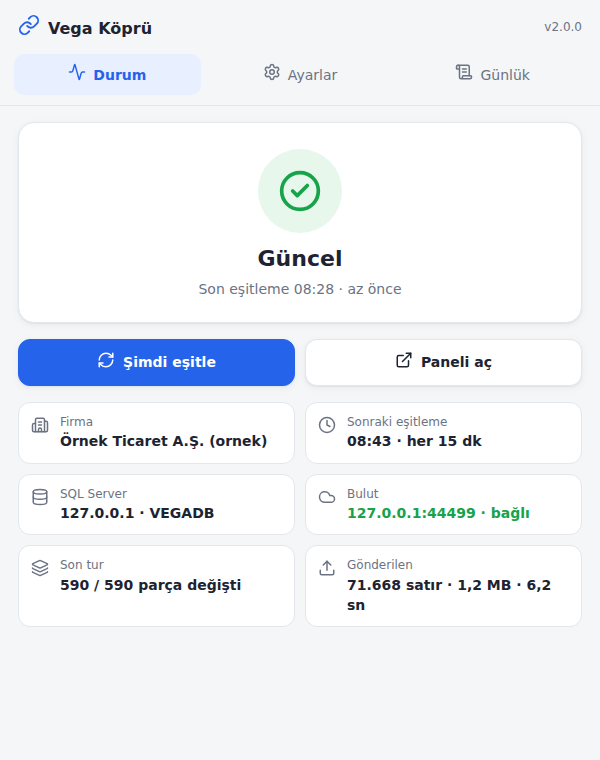
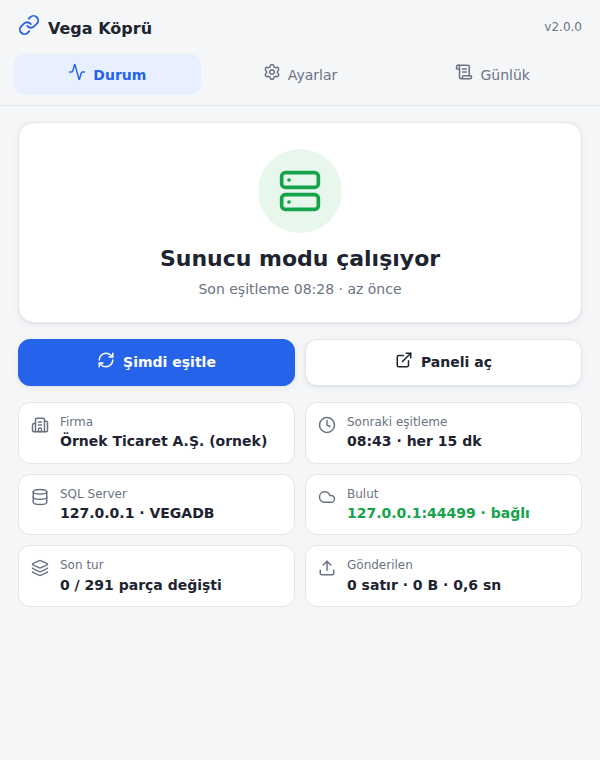
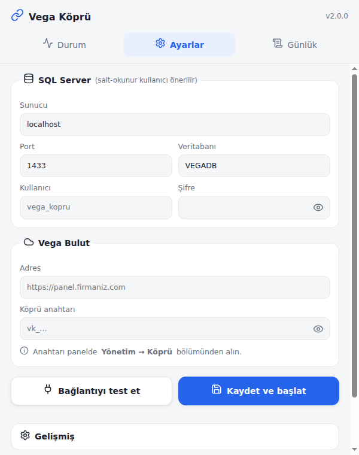

# Vega Köprü

Müşterinin SQL Server'ındaki Arctos/Vega veritabanını (VEGADB) **salt-okunur** okur, kanonik veri
kümelerine çevirir ve 15 dakikada bir Vega Bulut'a **HTTPS** ile gönderir.

- Yalnız **dışarı giden 443** bağlantısı gerekir. Müşteri ağında port açılmaz, VPN gerekmez.
- Yalnız `SELECT` çalıştırır; önerilen kullanıcı yalnız `db_datareader` rolündedir.
- Yalnız **değişen** ay/kova parçaları gönderilir (parmak izi: `COUNT + CHECKSUM_AGG(BINARY_CHECKSUM) + SUM`).
- SQL Server 2008 ve üstüyle uyumlu; kurulumda olmayan kolonlar otomatik `NULL` gelir.
- Panelde **"Şimdi güncelle"** basılınca köprü en geç 60 sn içinde eşitlemeye başlar.

| Durum | Sunucu modu | İlk açılış (ayarlar) |
|---|---|---|
|  |  |  |

---

## Kurulum (Windows, tepsi uygulaması)

1. **Salt-okunur SQL kullanıcısı** — SSMS'te `sa` ile [bridge/sql/salt-okunur-kullanici.sql](../bridge/sql/salt-okunur-kullanici.sql)
   betiğini çalıştırın (şifreyi değiştirin; veritabanı adı farklıysa `USE [VEGADB]` satırını düzeltin).
2. `VegaKopru-Setup-x.y.z.exe` → kurun. Uygulama tepsiye yerleşir ve ayar penceresi açılır.
3. **SQL Server**: sunucu (`SUNUCU\SQLEXPRESS`, `.` veya `localhost` da olur), port (adlandırılmış örnekte gerekmez),
   veritabanı (`VEGADB`), kullanıcı (`vega_kopru`), şifre.
4. **Vega Bulut**: adres (`https://panel.firmaniz.com`) ve **köprü anahtarı** (`vk_…`, panelde *Yönetim → Köprü*).
5. **Bağlantıyı test et** → SQL sürümü, firma/dönem sayısı ve buluttaki firma adı görünür.
   Birden çok firma varsa gönderilecekleri seçebilirsiniz (varsayılan: hepsi).
6. **Kaydet ve başlat** → ilk eşitleme başlar; bitince durum **Güncel** olur.

Eski **Vega Sorgu** masaüstü uygulaması kuruluysa, yeni sürüm otomatik güncellemeyle gelir ve eski
SQL ayarları (`%APPDATA%\vega-sorgu-desktop\config.json`) otomatik alınır — yalnız bulut adresi ve
anahtar girilir.

### Oturum açılmadan çalışma (sunucu modu)

Tepsi uygulaması yalnız bir kullanıcı oturum açtığında çalışır. Sunucu yeniden başladığında kimse
oturum açmıyorsa: **Ayarlar → Çalışma → Sunucu modu → Kur** (Windows yönetici izni ister).

- `SYSTEM` hesabıyla, açılıştan 1 dk sonra başlayan **"Vega Kopru"** adlı bir Zamanlanmış Görev oluşturulur.
- Görev, kurulu uygulamanın kendi Electron'unu Node kipinde (`ELECTRON_RUN_AS_NODE`) köprünün komut
  satırıyla çalıştırır; ayrıca Node kurmak gerekmez. Süreç kapanırsa 15 sn içinde yeniden açılır.
- Tepsi uygulaması açıksa **izleyici** olur: "Sunucu modu çalışıyor" gösterir, "Şimdi eşitle" isteğini
  göreve iletir. Aynı anda iki eşitleme olmaz (ayar klasöründe `kopru.kilit`).
- Güncelleme kurulurken görev kendiliğinden duraklar (`kopru-servis.bekle`), yeni sürümle devam eder.
- Kaldırmak: aynı yerden **Kaldır**.
- Günlük: `%APPDATA%\vega-sorgu-desktop\servis.log`.

### Dosyalar (`%APPDATA%\vega-sorgu-desktop\`)

| Dosya | İçerik |
|---|---|
| `kopru.json` | Ayarlar (SQL şifresi ve köprü anahtarı şifrelenmiş) |
| `kopru-durum.json` | Son eşitleme, canlı durum (izleyici süreç buradan okur) |
| `kopru.log`, `servis.log` | Günlükler (2 MB'da döner) |
| `kopru.kilit` | Etkin eşitleyici kilidi (30 sn'de bir tazelenir, 150 sn'de bayatlar) |
| `kopru-servis.ps1`, `.xml` | Sunucu modu başlatıcısı ve görev tanımı (uygulama üretir) |

> Şifreleme bir **gizleme**dir (anahtar program içinde); asıl güvenlik salt-okunur SQL kullanıcısı ve
> klasörün Windows izinleridir. Anahtar sızarsa panelden iptal edip yenisini alın.

---

## Komut satırı (başsız / Linux / eski Windows)

Windows Server 2012 R2 gibi Electron'un desteklemediği sistemlerde Node.js 18+ ile çalışır:

```bash
cd bridge && npm install --omit=dev
node src/cli.js kur --sunucu https://panel.firmaniz.com --anahtar vk_firma_xxx \
  --sql-sunucu "SUNUCU\SQLEXPRESS" --sql-kullanici vega_kopru --sql-sifre '******' --veritabani VEGADB \
  [--firmalar 0101,0103] [--baslangic-yili 2021] [--kirli-okuma]
node src/cli.js test          # SQL + bulut bağlantısı
node src/cli.js bir-kez [--tam]
node src/cli.js calistir      # sürekli; Windows'ta Görev Zamanlayıcı / NSSM ile hizmet yapın
node src/cli.js durum
```

Ayar klasörü: `VEGA_KOPRU_DIR` (yoksa `%APPDATA%\vega-sorgu-desktop`, Linux'ta `~/.config/vega-sorgu-desktop`).

---

## Eşitleme protokolü

```
köprü                                           bulut (/api/kopru/v1, Bearer vk_…)
  │ POST /hello  {ajan: sürüm, makine, SQL sürümü}   → {protokol, firma, aralikDk}
  │ keşif: TBLFIRMA, TBLDONEM, gerekli tabloların kolonları (tek sorgu, sys.columns)
  │ her veri kümesi × firma × dönem × ay/kova için parmak izi
  │ POST /manifest {syncId, chunks:[{key,n,ck,sm}], scopes}  → {need:[…], drop:[…]}
  │ yalnız istenen parçalar: POST /chunk (gzip JSON, ≤ 20.000 satır/istek, çok parçalıysa staging)
  │ POST /commit  {syncId, istatistik}              → {veriSurumu, silinen, degisti}
  │ her 60 sn: GET /ping → {simdiEsitle, tamEsitleme, aralikDk}
```

- **Parça anahtarı**: `veri_kümesi|firma|dönem|parça` — parça ay (`2026-09`), kova (`b3` = id/2000) ya da boş.
- **Kapsam**: manifest yalnız taradığı kapsamlardaki (veri kümesi × firma × dönem) eski parçaları sildirebilir;
  taranmayan eski dönemler korunur.
- **Sıcak / soğuk**: içinde bulunulan ve bir önceki yılın dönemleri her turda; daha eski dönemler
  `eskiDonemSaat` (6) saatte bir taranır. **Tam eşitleme** (panelden) hepsini yeniden gönderir.
- **Atomiklik**: çok parçalı gönderimde eski satırlar, son parça gelene kadar yerinde kalır; veri
  sürümü yalnız `commit`'te ve **yalnız veri gerçekten değiştiyse** artar (arayüz boşuna yenilenmez).
- Tarih parametreleri daima tiplidir (`DateTime`): Türkçe oturumda `DATEFORMAT dmy` tuzağına düşülmez.

Ölçülen performans (Docker'da SQL Server 2022, Türkçe harmanlama, 2008 uyumluluk düzeyi, 3 firma / 9 dönem):
ilk eşitleme 590 parça · 71.668 satır · 1,26 MB · ~7 sn; değişiklik yokken 291 parçanın parmak izi · 0 gönderim · ~0,5 sn;
3 satır değişince yalnız 3 parça (745 satır, 13 KB).

---

## Sorun giderme

| Belirti | Neden / çözüm |
|---|---|
| "SQL Server girişi reddedildi" | Kullanıcı/şifre yanlış ya da SQL Server yalnız Windows kimlik doğrulamasında: SSMS → sunucu → Properties → Security → *SQL Server and Windows Authentication mode* + hizmeti yeniden başlatın. |
| "SQL Server'a bağlanılamadı" | Sunucu adı/port; **SQL Server Browser** hizmeti (adlandırılmış örnek için) ve **TCP/IP** protokolü (SQL Server Configuration Manager) açık olmalı. |
| "Köprü anahtarı geçersiz" | Anahtar iptal edilmiş ya da firma pasif. Panelden yeni anahtar alın. |
| "Sunucuya ulaşılamadı" | Makineden `https://panel…` açılıyor mu? Kurumsal vekil/güvenlik duvarı 443'ü engelliyor olabilir. |
| Durum "Güncel" ama rakamlar eski | Arctos'ta yeni dönem açıldıysa ilk tur biraz sürer; panelde *Yönetim → Köprü → Tam eşitleme*. |
| Yoğun saatlerde kilit beklemesi | *Ayarlar → Gelişmiş → Kilit beklemeden oku* (READ UNCOMMITTED). |
| Uyarı: "sysadmin yetkili kullanıcı" | `sa` ile bağlanmayın; salt-okunur kullanıcıyı kullanın. |
